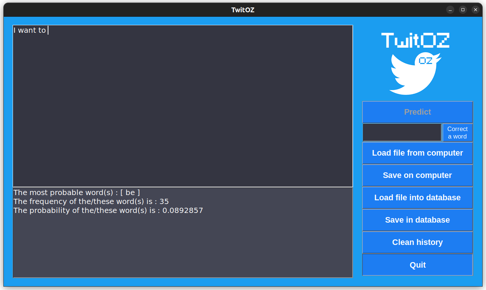

# <p align="center">  </p>


## Description

TwitOZ is a text predictor project developped in the Oz programming language as part of the course LINFO1104.
The principle is to predict the user's next word based on a database of tweets (N-grams algorithm).

The user can also try the predictions on their own database with the help of various extensions (see [How to use](#How-to-use)).

This project was completed in two weeks.


## Grade

20/20 ;)

## Authors

- **Authors:** Mathis Delsart and Cedric Kheirallah.

5 May 2023.

## Initial repository

The original repository can be found at https://github.com/CC4K/LINFO1104-TwitOZ.git, where you can review the initial version of the project (from start to finish).
I relocated this repository to be incorporated into my project for seamless management and development.


## Dependencies

To ensure successful execution of the app, you will need to have `Oz programming language (Mozart2)` and `CMake` `installed` on your machine.

You can download from the `official website`:
- http://mozart2.org/ (`Oz language`)
- https://cmake.org/install/ (`cmake`)

## Running the app

To compile:

- `make` (compiles automatically all `.oz` files, including extensions)

To clean:
```bash
make clean (cleans the `/bin` folder that contains all the binary files (`.ozf` files))
```
```bash
make clean_historic (cleans the `/user_historic` folder that contains the history of the user)
```
```bash
make clean_all (cleans both)
```

To run:
```bash
make run [option] (see below section `Extensions`)
```

To list commands:
```bash
make help (writes all the commands and options in your terminal)
```

### Extensions

Here are all the options you can use with `make run`:
- Optionnal arguments:
    - `idx_n_grams=[int]` [must be >= 1 | default: 2]
    - `corr_word=[int]` [1 = on | default: 0 = off]
    - `files_database=[int]` [1 = on | default: 0 = off]
    - `auto_predict=[int]` [1 = on | default: 0 = off]
    
- Mandatory arguments:
    - `folder=[string]` [default: "tweets"] (Not really mandatory but, in this case, you need to have the folder "tweets" present in your repository)

- Special arguments:
    - `ext=all` [all = activate all the extensions | default: none = does nothing]

### Examples :
```bash
make run folder="my_folder" idx_n_grams=4 ext=all
```
```bash
make run folder="my_folder" corr_word=1
```


## How to use

<p align="center">
    
</p>

### Predict

If you have the automatic prediction extension off, this button is used to predict the next word in regard to your input at this time. The button must be pressed every time you need a new prediction.

If the automatic prediction extension in on, this button will be greyed out and the program will predict the next word on every update of your input.

### Correct a word

Write a word in the box next to "Correct a word" button to see what other words the program would predict instead for each occurrence of your input word. 

If there is no match, the program will output "Correction : No words found."

If there is no better prediction, the program will output "Correction : your word is correct."

### Load file from computer

Opens a window to select a .txt file on your computer wich content will be brought back to the program as an input.

### Save on computer

Opens a window to save your current input as a file anywhere on your computer.

### Load file into database

Opens a window to select a .txt file from your computer to add to the application's historical records.

The selected file will be stored in the user_historic/user_files folder with a name in the format historic_partN.txt, where N is the part number.

All files saved in this folder are arranged chronologically, with historic_part1.txt being the oldest record.

The historical data serves as a secondary database, and the information from your file will be incorporated into the system to enhance future predictions.


### Save in database

This function loads the user's input into the historical records, similar to the `Load file into database` option.

### Clean history

Deletes saved files in `user_historic/user_files`

## Implementation

Here are some things to know about the implementation of the project.
If you are not a developer and just want to try the project, feel free to skip this section.

- Tree structure:

    The tree structure is created in two steps. First, we create the tree with lists of words and their frequencies (e.g., `['Word1'#Freq1 'Word2'#Freq2 ...]`). Then, we traverse the tree and update the values to create a subtree with frequencies as keys and lists of words as values. This approach makes it easier to insert values and avoids the need to delete nodes from the subtrees, which would be more difficult with a single-step implementation.

- Auto-prediction:

    The automatic prediction is implemented using a thread as a background process. This is a recursive procedure that runs indefinitely, repeating itself every 0.5 seconds. When the user presses the button to correct a word, the thread is stopped for 4 seconds (to allow the result to be displayed on the screen). This is done using a Port structure.

- User's historic:

    The `user_historic/` folder contains:

    - The `user_files/` folder
            => Folder that contains all the historic `.txt` files of the user.
            Useful for analyzing and parsing the data to use them for the next prediction.

    - The `last_prediction.txt` file
            => Useful for storing the last prediction to compare with the new one. It updates the prediction only if it is different, preventing a flash every 0.5 seconds. This is used for the auto-prediction extension.

    - The `nber_historic_files.txt` file
            => Useful for storing the number of historic files. This is useful at the beginning of the program to know how many files there are to analyze and parse and to know their names `user_history/user_files/historic_partN.txt` where N is the number of the file.

### Extensions:

The extensions are in a separate folder named `src/extensions`. The reason for this is because, for our project, we needed to easily distinguish the extension version from the basic one. If we didn't, we would probably put all the extension files into the other files, such as `src/tree.oz`, `src/interface.oz`, and `src/function.oz`.

The functions in the extension files are very long and not well separated. Therefore, the code is harder to read than the rest of the code. The only reason is the lack of time to totally clean all the files.


## Problems

If you are on MacOS and you are running into issues at compilation, you need to comment the image at Line 45 in `src/extensions/interface_improved`.
In that is the case, you also may not be able to see the colors of the buttons.

This issue might be due to the Oz programming language being inconsistent between platforms and we are sorry for the inconvenience it may cause.

In any case, you can see the expected result in the `./image` folder.
